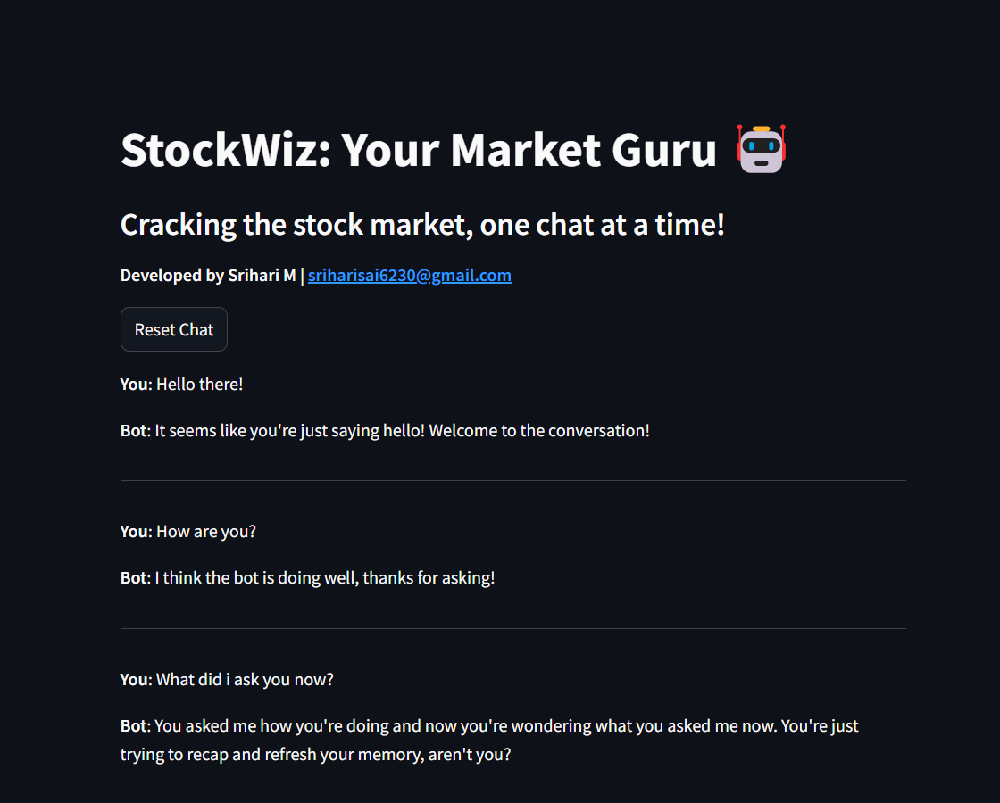

# StockWiz: Your Market Guru 🤖



## Overview

**StockWiz** is an intelligent Stock Market Chatbot developed using Python and the Groq AI API. The chatbot is designed to provide stock analysis, generate charts, and respond to user queries about stock prices, symbols, and relevant news. The project leverages Streamlit for the frontend interface and Flask for backend processing.

This project is being developed for submission to the [HackAI Challenge](https://hackaichallenge.devpost.com/) hosted on Devpost.

## Directory Structure

```plaintext
StockWiz/
│
├── app/
│   ├── [__init__.py](app/__init__.py)           # Initialization of the app module
│   ├── [analysis.py](app/analysis.py)           # Contains the logic for stock analysis and chart generation
│   └── [routes.py](app/routes.py)               # Flask routes handling incoming requests and responses
│
├── env/                                         # Virtual environment directory (ignored in the repo)
│
├── static/
│   ├── [.env](static/.env)                      # Environment variables for the project
│   └── [homepage.png](static/homepage.png)      # Image used in the README and as the frontend preview
│
├── [app.py](app.py)                             # Main Streamlit app file
├── [run.py](run.py)                             # Entry point for running the Flask app
├── [requirements.txt](requirements.txt)         # Python dependencies required for the project
└── [README.md](README.md)                       # Project documentation (this file)
```

## Installation

To set up the project on your local machine, follow these steps:

1. **Clone the repository:**

   ```bash
   git clone <repository-url>
   cd StockWiz
   ```

2. **Create and activate a virtual environment:**

   ```bash
   python -m venv env
   source env/bin/activate  # On Windows: env\Scripts\activate
   ```

3. **Install the required dependencies:**

   ```bash
   pip install -r requirements.txt
   ```

4. **Set up environment variables:**

   - Create a `.env` file in the `static` folder with necessary API keys and configuration settings.

5. **Run the Flask backend:**

   ```bash
   python run.py
   ```

6. **Run the Streamlit frontend:**

   In a new terminal window, navigate to the project directory and run:

   ```bash
   streamlit run app.py
   ```

## Docker Setup

If you prefer to run StockWiz using Docker, follow these steps:

### Prerequisites

- Make sure you have Docker installed on your system.

### Pull the Docker Image

To get the latest version of StockWiz as a Docker image, run:

```bash
docker pull kingpin620/stockwiz:latest
```

### Running the Docker Container

After pulling the image, start a container with:

```bash
docker run -p 8501:8501 -p 5000:5000 kingpin620/stockwiz:latest
```

### Accessing the Application

- **Streamlit Interface**: Open your web browser and navigate to `http://localhost:8501`.
- **Flask Backend**: The Flask backend will be accessible at `http://localhost:5000`.

### Stopping the Container

To stop the Docker container, press `Ctrl+C` in the terminal where the container is running. Alternatively, use:

```bash
docker stop <container_id>
```

## Usage

Once the project is set up and running:

- Open your web browser and navigate to the local Streamlit app URL provided in the terminal.
- Interact with the StockWiz chatbot to ask about stock prices, symbols, or request chart analyses.

## File Descriptions

- **[`app/__init__.py`](app/__init__.py)**: Initializes the app module.
- **[`app/analysis.py`](app/analysis.py)**: Contains the main logic for analyzing stock data, generating charts, and processing news.
- **[`app/routes.py`](app/routes.py)**: Defines the Flask routes that handle incoming requests from the frontend and return responses.
- **[`app.py`](app.py)**: The Streamlit app that serves the chatbot frontend, handles user input, and displays responses.
- **[`run.py`](run.py)**: The entry point for running the Flask backend server.
- **[`requirements.txt`](requirements.txt)**: Lists all the Python packages and dependencies required to run the project.
- **[`static/homepage.png`](static/homepage.png)**: The image used in the README to showcase the frontend of the chatbot.

## Contributing

Contributions are welcome! Please feel free to fork this repository and submit pull requests.

## Contact

Developed by **Srihari M**  
Email: [sriharisai6230@gmail.com](mailto:sriharisai6230@gmail.com)
